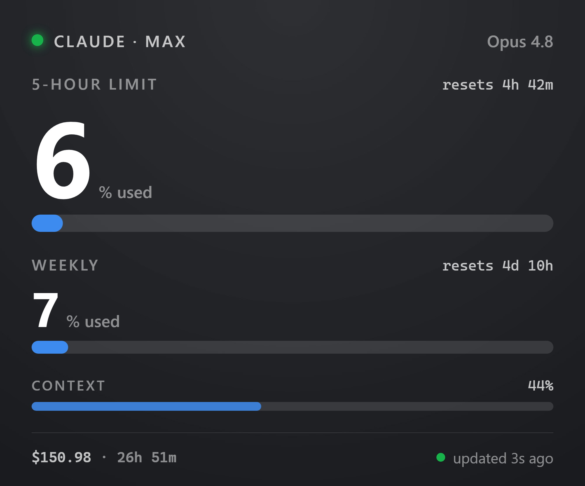
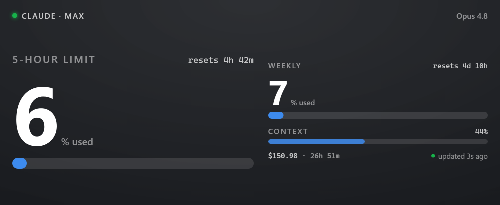

# Xeneon Claude Code Companion

Turn a **CORSAIR Xeneon Edge** touchscreen into a live monitor for your **Claude Code**
sessions — 5‑hour and weekly rate‑limit usage, context‑window fill, session cost, and
elapsed time, updating in real time while you work in a plain terminal.

The package has two parts:

| Part | What it is | Where |
|---|---|---|
| **`xeneon-bridge`** | A single Go binary. Runs a tiny HTTP server on `127.0.0.1`, receives usage from Claude Code's statusline, and serves it to the widget. Runs portable (`serve`) or as a Windows service. | [`companion/`](companion/) |
| **Claude Usage widget** | An iCUE HTML widget for the Xeneon Edge. Polls the bridge and draws the display. The bridge hooks in through Claude Code's statusline. | [`claudeusage/`](claudeusage/) |

---

## Screenshots

The **medium** (840×696) layout — the full stack of 5‑hour and weekly limits, context window, and
session cost — shown with a single session and with the multi‑session switcher (`‹ folder n/m ›`;
tap the arrows or swipe to flip between sessions):

| One session | Multiple sessions |
|:---:|:---:|
|  |  |

The **small** (840×344) layout rearranges the same data into a wide strip:



---

## Prerequisites

- **Windows 10/11** (the bridge's `serve` mode is cross‑platform, but the Windows *service* commands and the widget target Windows).
- **[Go](https://go.dev/dl/) 1.26+** — to build the bridge.
- **[iCUE](https://www.corsair.com/icue) 5.44 or later** — to install the widget.
- **iCUE Widget CLI** (`icuewidget`) — to package the widget. (Only needed if you want to build the `.icuewidget` yourself)
- A **CORSAIR Xeneon Edge** to display on.
- **Claude Code**, signed in on a Pro/Max plan.

---

## Repository layout

```
.
├── companion/        Go module `xeneoncc` — the xeneon-bridge binary
│   ├── main.go               command dispatch: serve | service | statusline | hook
│   └── internal/…            server, config, store, Claude Code adapters
├── claudeusage/      The iCUE widget
│   ├── index.html           markup + CSS + polling/render logic
│   ├── manifest.json        widget metadata (interactive: true)
│   ├── translation.json
│   └── resources/icon.svg
└── docs/, references/, skill.md, evals/
                      CORSAIR iCUE widget-SDK reference material used while building.
                      Not part of the shippable package — you can leave these out of a
                      public repo if you only want to publish the bridge + widget.
```

---

## Part 1 — Build the bridge

From the `companion/` directory:

```powershell
cd companion
go build -o xeneon-bridge.exe .
```

That produces a single self‑contained `xeneon-bridge.exe`. The one dependency
(`golang.org/x/sys`, pinned in `go.mod`) is fetched automatically on first build, so the
initial build needs network access; after that it builds offline.

Put the binary somewhere stable that you won't move — e.g. `C:\Tools\xeneon-bridge\` — because
Claude Code's config and (optionally) the Windows service will reference it by path.

Check it runs:

```powershell
.\xeneon-bridge.exe
# usage: xeneon-bridge <serve|service|statusline|hook>
```

---

## Part 2 — Run the bridge

You have two ways to run it. **Portable mode** is simplest for trying it out; **service mode**
is best for a permanent, always‑on setup.

### Option A — Portable mode (`serve`)

Runs in the foreground until you press **Ctrl‑C**:

```powershell
.\xeneon-bridge.exe serve
# listening on http://127.0.0.1:8787
# xeneon-bridge ready on port 8787 (token in C:\Users\<you>\.xeneon-bridge\config.json)
```

On first run it creates a config file with a **random token** and port `8787`:

```
%USERPROFILE%\.xeneon-bridge\config.json
```
```json
{ "port": 8787, "token": "…64-hex-chars…" }
```

You'll paste that `token` into the widget later.

**To keep it running after you close the terminal** (without a service), drop a shortcut to
`xeneon-bridge.exe serve` into your Startup folder (`shell:startup`), or create a Task Scheduler
task "at log on." For a hands‑off, boots‑before‑login setup, use service mode instead.

### Option B — Windows service mode

Installs `xeneon-bridge` as a proper Windows service (**`XeneonBridge`**, LocalSystem, automatic
start), so it starts on boot and runs in the background. **Run these from an elevated
(Administrator) PowerShell.**

```powershell
# Install (creates the service + machine-wide config, prints the token)
.\xeneon-bridge.exe service install

# Control
.\xeneon-bridge.exe service start
.\xeneon-bridge.exe service status
.\xeneon-bridge.exe service stop

# Remove (stops first, then deletes). Add --purge to also delete the config dir.
.\xeneon-bridge.exe service uninstall
.\xeneon-bridge.exe service uninstall --purge
```

In service mode the config lives machine‑wide at:

```
C:\ProgramData\xeneon-bridge\config.json      ← token + port
C:\ProgramData\xeneon-bridge\bridge.log       ← service log
```

`service install` **migrates an existing portable token** (from `%USERPROFILE%\.xeneon-bridge`)
into `C:\ProgramData\xeneon-bridge` if one is there, so the widget keeps working without a
re‑paste. Once the service config exists, every other subcommand (including `statusline`) reads
that same machine‑wide config automatically — so the statusline and the service always agree on
the token.

Both modes bind loopback only (`127.0.0.1` **and** `[::1]`) on port `8787`. Run **one** of the
two modes at a time — they'd otherwise fight over the port.

---

## Part 3 — Wire Claude Code's statusline

This is what feeds live data into the bridge. Claude Code runs your `statusLine` command every time
it renders the status bar and pipes it a JSON blob — model, cost, duration, context‑window %, and
(on Pro/Max) the 5‑hour and weekly rate‑limit figures. The bridge's `statusline` subcommand reads
that JSON and posts it to the running bridge. Pick whichever of the three wirings below fits how you
already run your statusline.

> **Windows path tip:** Claude Code runs the statusline command through Git Bash, so use
> **forward‑slash** paths (`C:/Tools/…/xeneon-bridge.exe`) everywhere below. Windows backslashes get
> swallowed by the shell and you'll get "command not found" and a blank status bar.

### Option A — let the bridge be your statusline

Simplest, if you don't have a statusline you care about. In `~/.claude/settings.json`:

```json
{
  "statusLine": {
    "type": "command",
    "command": "C:/Tools/xeneon-bridge/xeneon-bridge.exe statusline"
  }
}
```

The bridge posts the numbers and prints its own minimal bar (`Model | wk NN% | $C.CCC`).

### Option B — wrap an existing statusline command

Keep the bridge as the `statusLine` command and point the `XENEON_WRAP_CMD` environment variable at
your current statusline command. The bridge posts the numbers, then runs your command and passes its
output straight through to the terminal — so your bar looks exactly the same.

### Option C — keep your statusline script, just feed the bridge from it

If your statusline is already a shell script (e.g. `~/.claude/statusline.sh` that renders your own
bar with `jq`), you don't need to replace or wrap it — add **one fully‑detached line** that feeds
the bridge. Where the script captures the incoming JSON (most do `input=$(cat)` near the top), add:

```bash
input=$(cat)   # you almost certainly already have this line

# Post usage to the Xeneon bridge, fully detached so a slow or down bridge never
# delays your bar. Its own output is discarded — your script still renders as usual.
( printf '%s' "$input" | "C:/Tools/xeneon-bridge/xeneon-bridge.exe" statusline >/dev/null 2>&1 & )

# ... the rest of your script prints your statusline exactly as before ...
```

The `( … & )` subshell detaches the post, so your bar keeps rendering in well under a second even if
the bridge is down or slow. Don't set `XENEON_WRAP_CMD` in this mode — here the bridge is used purely
for its POST side effect, and your script owns the visible output.

---

## Part 4 — Package the widget

The widget source is in [`claudeusage/`](claudeusage/). To build the installable `.icuewidget`
you need the **iCUE Widget CLI** (`icuewidget`) on your PATH.

```powershell
# From the repo root
icuewidget validate claudeusage
icuewidget package claudeusage -o claudeusage.icuewidget
```

`validate` checks the structure/manifest; `package` produces `claudeusage.icuewidget`, the single
file you install in iCUE.

Notes for anyone editing the widget:
- `manifest.json` sets **`"interactive": true`** — required, or touch/tap/swipe never reach the
  widget.
- iCUE's in‑app importer is stricter than `validate`: keep `<title>` **before**
  `<link rel="icon">` in the `<head>`, with an uppercase `<!DOCTYPE html>`. (The current
  `index.html` already follows this.)

---

## Part 5 — Install the widget in iCUE

1. Make sure the **bridge is running** (Part 2) and the **statusline is wired** (Part 3).
2. Open **iCUE** (5.44+).
3. Go to the **widgets** section, click the **+** above the list of available widgets, and select
   your `claudeusage.icuewidget` file.
4. **Claude Usage** now appears in the widget list — add it to your **Xeneon Edge** canvas/layout.
5. Open the widget's **settings** and fill in the **Connection** group:
   - **Bridge Token** — paste the `token` from your `config.json`
     (`%USERPROFILE%\.xeneon-bridge\config.json` in portable mode, or
     `C:\ProgramData\xeneon-bridge\config.json` in service mode). *This is the one required step.*
   - **Bridge URL** — leave as `http://localhost:8787` unless you changed the port.
   - **Refresh** — poll interval in seconds (default 2).
   - **Show** — display limits as **Used** or **Left**.
   - **Inactivity timeout** — how long a quiet session stays on screen before the widget goes idle
     (default 30 min).
   - Plus **Personalization** (text/accent/background color, transparency).

Start a Claude Code session and the numbers appear within a second or two.

**Updating the widget later:** re‑importing on top of a running instance doesn't always take.
The reliable way to update is to **remove the existing Claude Usage widget from the layout, then
import the new `.icuewidget` and add it back**.

---

## Troubleshooting

| Symptom | Fix |
|---|---|
| Widget shows **"Add your bridge token in settings"** | Paste the `token` from `config.json` into the widget's **Bridge Token** setting. |
| Widget shows **"Bridge offline…"** | The bridge isn't running or the URL/port is wrong. Start it (`serve` or `service start`) and confirm **Bridge URL** = `http://localhost:8787`. |
| Widget shows **"Waiting for Claude Code…"** | Bridge is up but no session has posted real usage yet. Start a `claude` session; make sure the **statusline** is wired (Part 3). |
| Numbers never update | The statusline command path is wrong or points at the wrong binary. Verify the path in `~/.claude/settings.json` and that token matches. |
| **`service install` → "access denied"** | Run the command from an **elevated (Administrator)** PowerShell. |
| Taps/swipes do nothing on device | The installed widget is missing `"interactive": true`, or it's a stale import — re‑package and re‑import fresh (remove, then add). |
| Rate‑limit figures show `—` | The 5‑hour/weekly fields only appear on Pro/Max plans and after the first API response of a session. |

---

## License

MIT
